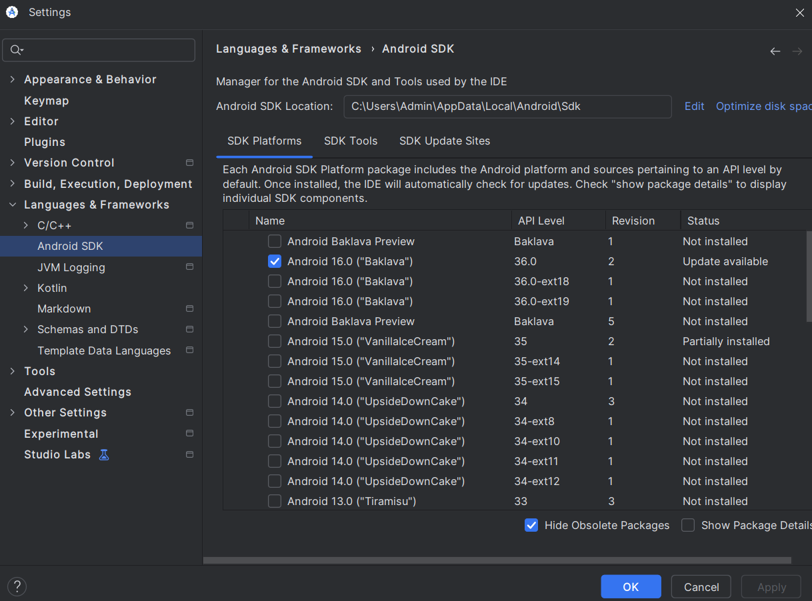
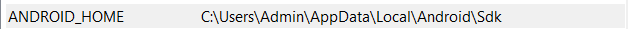
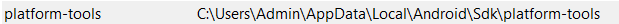
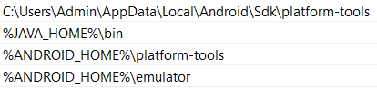

# Install Vasbia

### requirement
- OpenJDK version **17** !!! _( java --version )_ https://www.oracle.com/java/technologies/javase/jdk17-archive-downloads.html
- Node version **> 18** _( npm --version )_
- Android Studio version latest 

### Setup enviroment
> **Window** : open android studio > setting > language and framwork > Android SDK > Copy link Android SDK Location 



> open edit enviroment on window > enviroment variables > Click New (system)> ANDROID_HOME, JAVA_HOME, platform-tools






> Go to Path (System) > edit > new > set ANDROID_HOME, JAVA_HOME, platform-tools, emulator



### How to run vasbia

```git clone https://github.com/Vasbia/vasbia-react-native.git``` 
```cd vasbia-react-native```
```npm install``` (for typeScript)
```cd vasbia```
```npm install``` (for react-native, maplibre)

**open 2 terminal**
terminal 1 : ```npm start```
terminal 2 : ```npm run android```